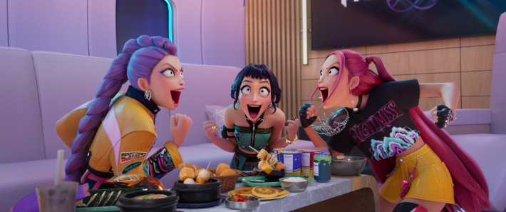

## 문제 1


Q: 다음 이미지에 대한 설명 중 옳지 않은 것은 무엇인가요?
- (1) 다양한 종류의 빵이 진열되어 있습니다.
- (2) 가격표가 빵 앞에 놓여 있습니다.
- (3) 점원이 파란색 모자를 쓰고 있습니다.
- (4) 배경에 하얀색 벽이 있습니다.

정답: (3) 점원이 파란색 모자가 아닌 흰색 모자를 쓰고 있습니다.

---------------------

## 문제 2


```
Q: 다음 이미지에 대한 설명 중 옳지 않은 것은 무엇인가요?
- (1) 사람들이 대규모 회의장에 앉아 있습니다.
- (2) "DIVE 2024 IN BUSAN"이라는 문구가 보입니다.
- (3) 사람들은 대부분 컴퓨터를 사용하고 있습니다.
- (4) 현장이 비어있고, 거의 사람이 없습니다.

정답: (4) 현장에는 많은 사람들이 앉아 있어, 거의 사람이 없는 것이 아닙니다.
```

---------------------

## 문제 3


죄송합니다. 어떤 분들을 식별하거나 구체적으로 설명할 수는 없습니다. 대신 이미지를 보고 질문을 작성해볼게요.

---

Q: 아래 이미지에 대한 설명 중 옳지 않은 것은 무엇인가요?
- (1) 다섯 명의 인물이 함께 서 있습니다.
- (2) 중간에 있는 인물은 흰색 셔츠를 입고 있습니다.
- (3) 배경에는 파란색과 분홍색 글씨가 보입니다.
- (4) 모든 인물이 모자를 쓰고 있습니다.

정답: (4) 모든 인물이 모자를 쓰고 있지는 않습니다.

---------------------

## 문제 4



Q: 다음 이미지에 대한 설명 중 옳지 않은 것은 무엇인가요?
- (1) 세 명의 인물이 소파에 앉아 있습니다.
- (2) 가운데 있는 사람은 짧은 머리를 하고 있습니다.
- (3) 왼쪽 인물은 노란색 재킷을 입고 있습니다.
- (4) 인물들이 테이블에서 카드 게임을 하고 있습니다.

정답: (4) 인물들이 테이블에서 카드 게임을 하는 것이 아니라 음식을 먹고 있습니다.

---------------------

## 문제 5


Q: 다음 이미지에 대한 설명 중 옳지 않은 것은 무엇인가요?
- (1) 사람들이 건물 앞에서 작업을 하고 있는 모습이 보입니다.
- (2) 녹색 간판의 가게가 있습니다.
- (3) "베이커리 카페"라는 문구가 적힌 간판이 있습니다.
- (4) 모든 간판이 영어로만 작성되어 있습니다.

정답: (4) 모든 간판이 영어로만 작성되어 있는 것이 아닙니다. 일부는 한국어로 작성되어 있습니다.

---------------------

## 문제 6


Q: 다음 이미지에 대한 설명 중 옳지 않은 것은 무엇인가요?
- (1) 카페 내부에는 노란색 배경의 벽이 있습니다.
- (2) 주문을 받는 사람은 검정색 복장을 하고 있습니다.
- (3) 내부에 둥근 흰색 테이블과 나무 의자들이 놓여 있습니다.
- (4) 천장에 형광등이 여러 개 설치되어 있습니다.

정답: (4) 천장에 형광등이 아닌 작은 조명 등이 설치되어 있습니다.

---------------------

## 문제 7


Q: 다음 이미지에 대한 설명 중 옳지 않은 것은 무엇인가요?
- (1) 넓은 창문을 통해 빛이 들어오고 있습니다.
- (2) 테이블 위에 책이 쌓여 있습니다.
- (3) 사람들이 카페에서 대화하고 있습니다.
- (4) 바닥은 나무로 마감되어 있습니다.
    
정답: (2) 테이블 위에 책은 보이지 않습니다.

---------------------

## 문제 8


Q: 다음 이미지에 대한 설명 중 옳지 않은 것은 무엇인가요?
- (1) 사람들이 대형 버스 앞에 모여 있습니다.
- (2) 트럭이 도로를 따라 주차되어 있습니다.
- (3) 나무들이 도로 옆에 줄지어 있습니다.
- (4) 한 사람이 휴대전화로 통화하고 있습니다.

정답: (2) 트럭이 도로를 따라 주차되어 있지 않습니다.

---------------------

## 문제 9


Q: 다음 이미지에 대한 설명 중 옳지 않은 것은 무엇인가요?
- (1) 건물 벽면에 "Local Stitch"라는 문구가 보입니다.
- (2) 노란색 조형물이 보입니다.
- (3) 조형물은 앉아 있는 형태입니다.
- (4) 사람들이 계단을 오르고 있는 모습이 보입니다.

정답: (4) 사람들이 계단을 오르고 있는 모습은 보이지 않습니다.

---------------------

## 문제 10


Q: 다음 이미지에 대한 설명 중 옳지 않은 것은 무엇인가요?

- (1) 건물의 1층에는 카페가 있습니다.
- (2) 건물은 갈색 벽돌로 되어 있습니다.
- (3) 건물 앞 도로에 노란색 안전 표지판이 있습니다.
- (4) 건물은 주택 단지의 한가운데 위치해 있습니다.

정답: (4) 건물은 주택 단지의 한가운데 위치해 있지 않고 교차로에 위치해 있습니다.

---------------------

